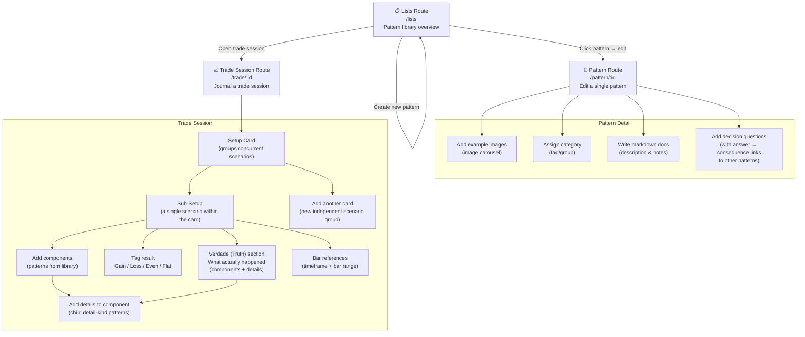

# App Overview

A trading pattern management and session journaling tool. Users build a library of reusable trading patterns ("components") and then apply them to real trade sessions for analysis and review.

## Route Summary

| Route | Purpose |
|---|---|
| `/lists` | Browse all patterns; create new ones; open trade sessions |
| `/pattern/:id` | Edit a pattern — images, category, markdown docs, questions |
| `/trade/:id` | Journal a trade — build setups from patterns, record outcome and truth |
| `/auth/login` | Email/password sign-in |
| `/auth/signup` | New account registration |

## Authentication

Uses **better-auth** with email/password strategy.

- `src/lib/auth.ts` — Server-side `auth` instance (drizzle adapter, PostgreSQL, basePath `/api/auth`)
- `src/lib/auth-client.ts` — Client-side `authClient` (auto-detects `window.location.origin`)
- `src/db/auth-schema.ts` — DB tables for better-auth users/sessions
- `src/routes/api/auth/[...all].ts` — HTTP handler that forwards to better-auth
- `src/components/AuthGuard.tsx` — Wraps the app; checks session client-side and redirects unauthenticated users away from protected paths (`/lists`, `/pattern`, `/trade`). Skips SSR fetch (cookies not available server-side), triggers on client hydration.
- `src/lib/orpc.server.ts` — Injects `user` into oRPC context per-request by calling `auth.api.getSession({ headers })`. Routes using `authed` middleware throw `UNAUTHORIZED` if no session.
- `src/orpc.ts` — Defines `pub` (public) and `authed` (requires `context.user`) procedure builders. `UserSchema` has `id: number`, `userName`, `email`.

**Note:** `storeContext.tsx` previously hardcoded `user.id: 1` — this is now replaced by real session-based user injection via the oRPC server context.

## Key Concepts

- **Component / Pattern** — A named trading formation (e.g. "Bull Flag"). Can be `kind: "component"` (main) or `kind: "detail"` (sub-pattern used inside a main component).
- **Setup Card** — A container holding one or more sub-setups for the same trade event.
- **Sub-Setup** — One scenario within a card. Multiple sub-setups allow exploring "what if" alternatives concurrently.
- **Verdade (Truth)** — After the fact annotation: which patterns actually played out, independent of what was anticipated in the setup.
- **Bar Reference** — Anchors a sub-setup to a specific timeframe and bar range (e.g. `h1 b3..7`) for chart replay review. Each setup has its own bar reference.
- **Detail** — A child pattern attached to a component inside a setup, adding specificity (e.g. "Bull Flag" → "High Volume Breakout").
- **Image sequences on setups** — A sequence of images can be attached directly to a setup (not just to patterns).
- **Copy component to setup** — A component/pattern from the library can be copied directly into the currently selected setup.
- **Ctrl+arrow navigation** — Keyboard shortcut (`Ctrl+Left` / `Ctrl+Right`) navigates to the previous/next setup within a card.
- **Multiple setups per card** — A card can contain multiple independent setups (not just sub-setups as "what if" scenarios).
- **Evolution tracking** — A setup can reference a previous setup to track how a trade scenario evolves over time.
- **Multi-asset tabs** — The UI supports tabs for managing and viewing multiple assets simultaneously.

## Key Components

### `LeftPanel` (`src/components/trade/LeftPanel.tsx`)
Left sidebar in the trade route. Shows:
- Search bar filtering the pattern library
- **Padrões** card: all filtered patterns as `ComponentBadge` items. Clicking a badge routes to either `addTruthComp` (if verdadeTarget matches selectedSetup) or `addSelectedComps`.
- **Detalhes** card (conditional): appears when a component is tagged (`taggedComps`). Shows the tagged component's associated detail patterns as badges; double-click to `addDetails`.

Props of note: `selectedSetup`, `verdadeTarget`, `taggedComps`, `verdadeTarget`-vs-`selectedSetup` comparison determines whether a click adds to the truth or to the active setup.

### `PatternEdit` (`src/components/pattern/PatternEdit.tsx`)
Pure presentational component for the `/pattern/:id` route. Sections:
1. **Title** — inline edit toggle (click to activate `TextFieldInput`, blur to save)
2. **Images** — `ImageCaroulsel` + `UploadButton` (uploadthing endpoint `imageUploader`)
3. **Categoria** — free-text input
4. **Markdown** — `<textarea>` with `field-sizing-content` (auto-height)
5. **Perguntas (Questions)** — list of questions, each with: text input, function `Select` (`Especificação | Detalhe | Contexto`), answer rows (answer text + consequence component `Select`), add/remove buttons
6. **Detalhes** — `Combobox` to search & associate existing detail-kind patterns; inline "Criar detalhe" button if typed name has no match; chip list of currently associated details with remove button
