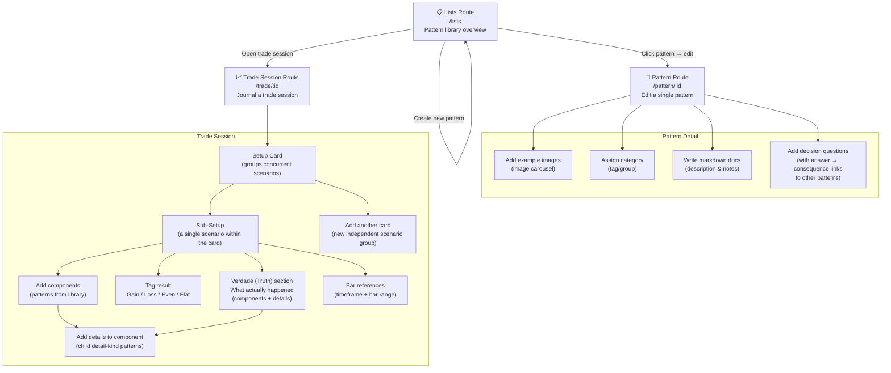

# App Overview

A trading pattern management and session journaling tool. Users build a library of reusable trading patterns ("components") and then apply them to real trade sessions for analysis and review.

## Route Summary

| Route | Purpose |
|---|---|
| `/lists` | Browse all patterns; create new ones; open trade sessions |
| `/pattern/:id` | Edit a pattern — images, category, markdown docs, questions |
| `/trade/:id` | Journal a trade — build setups from patterns, record outcome and truth |

## Key Concepts

- **Component / Pattern** — A named trading formation (e.g. "Bull Flag"). Can be `kind: "component"` (main) or `kind: "detail"` (sub-pattern used inside a main component).
- **Setup Card** — A container holding one or more sub-setups for the same trade event.
- **Sub-Setup** — One scenario within a card. Multiple sub-setups allow exploring "what if" alternatives concurrently.
- **Verdade (Truth)** — After the fact annotation: which patterns actually played out, independent of what was anticipated in the setup.
- **Bar Reference** — Anchors a sub-setup to a specific timeframe and bar range (e.g. `h1 b3..7`) for chart replay review.
- **Detail** — A child pattern attached to a component inside a setup, adding specificity (e.g. "Bull Flag" → "High Volume Breakout").
